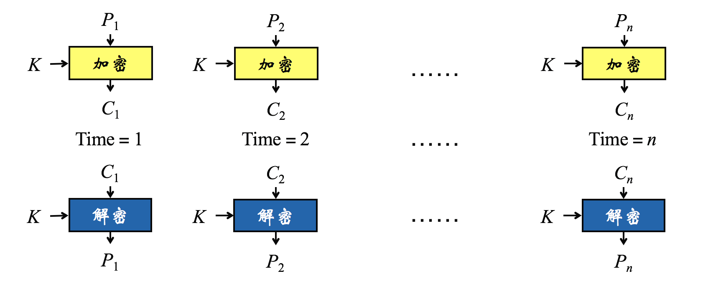
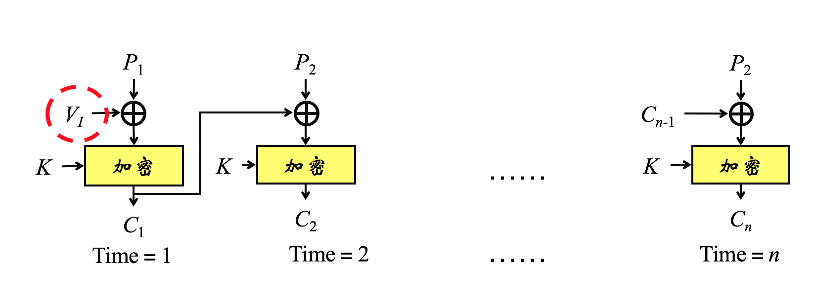
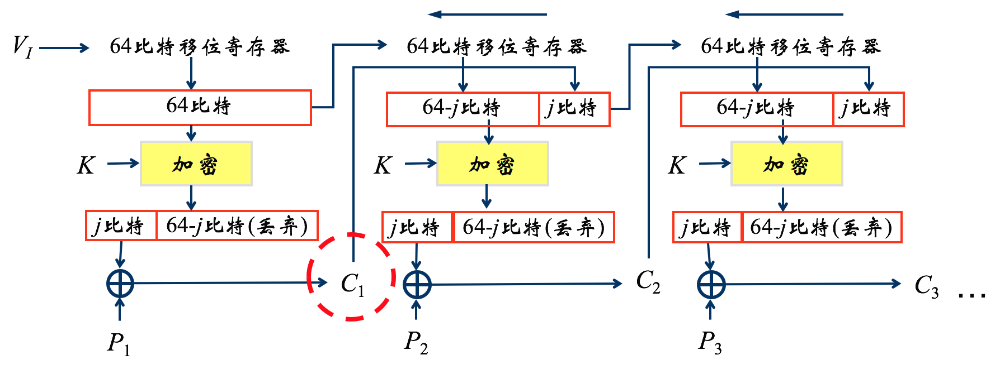
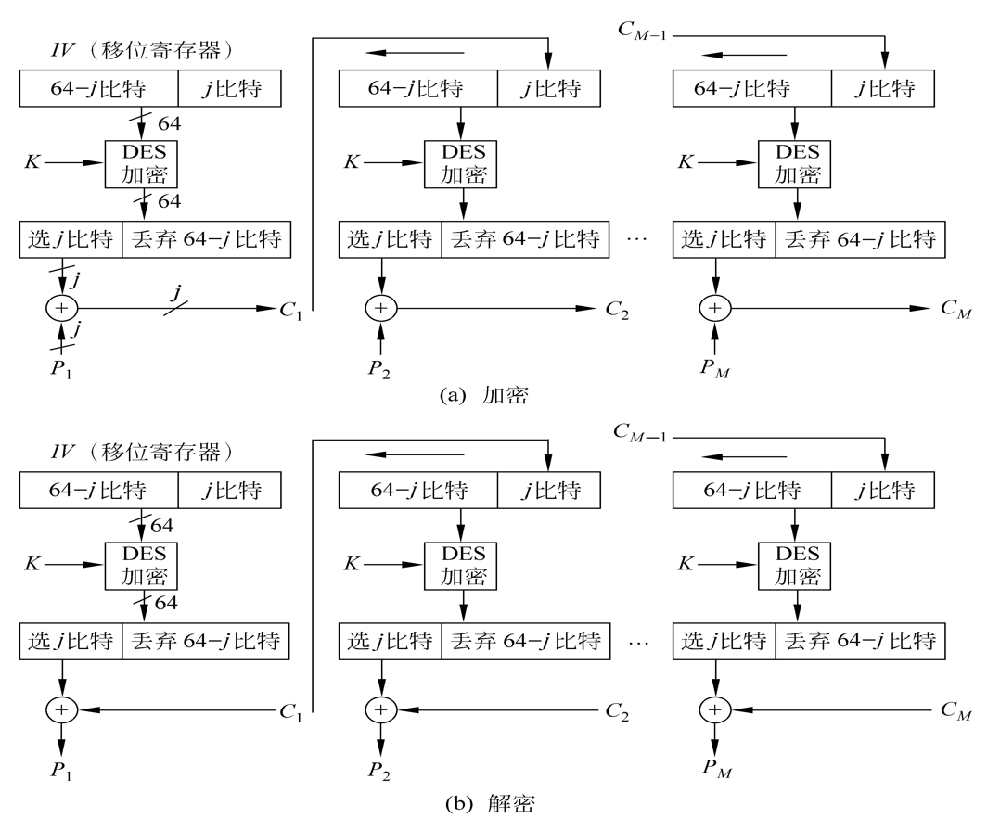
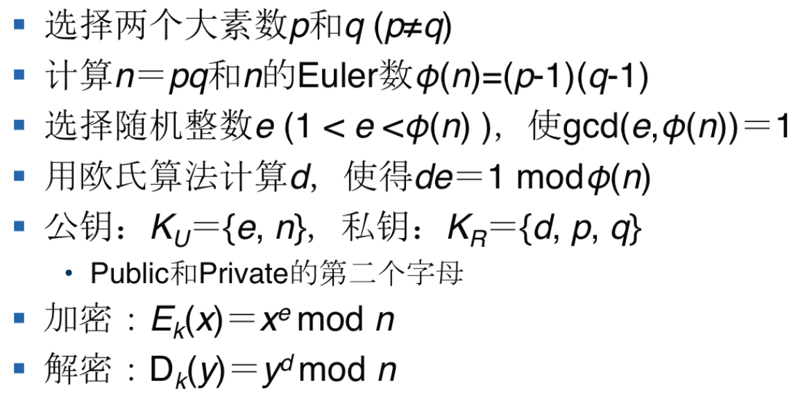

## 1.	最可靠的密码破解方法
穷举法

## 2.	密码学成为一门新的学科的时间

1975年 

---
1975

1949年前	古典密码学（经典密码学）  
1975年前	常规现代密码学  
1976年后	公钥密码学  
或  
1949年前	古典密码学（经典密码学）  
1949年后	现代密码学  
1975年前	密码学成为科学  
1976年后	密码学新方向——公钥密码学  

------



## 3.	密码系统可以用一个几元组进行形式化描述

五

* 明文（Plaintext）
* 密文(Ciphertext)
* 密钥(Key)
* 加密算法(Encryption Algorithm) 
* 解密算法(Decryption Algorithm)

-------------
一个密码系统是满足以下条件的五元组（P,C,K,E,D）  
P(明文空间)：所有可能的明文组成的有限集  
C(密文空间)：所有可能的密文组成的有限集  
K(密钥空间)：所有可能的密钥组成的有限集  
对任意的k∈K ，都存在一个加密算法ek∈E和相应的解密算法dk∈D。且每个ek: P C ，dk: C P ，使得任给m∈P ，均有dk(ek(m)) = m.  

--------


## 4.	取代DES称为新的美国联邦加密标准的是
AES

1973
1998年底失效
被AES取代

## 5.	网络安全的核心技术

* 数据加密技术
* 网络病毒防治技术
* 密码技术


## 6.	计算机信息安全服务有哪些

* 鉴别服务
* 访问控制服务
* 数据保密性服务
* 数据完整性服务
* 不可否认服务


## 7. 公钥密码体制算法有哪些

* RSA 算法
* ElGamal 算法
* 椭圆算法 (ECC)

## 8. 古典密码技术的基本加密单元

密码算法针对的是字符


## 9. 明文字母表由26个符号，则该字母表存在多少种单字母替换密码

26!

## 10. 每个明文字母映射到一个固定的密文字母，属于什么密码

单字母表替换密码

## 11. 置换密码有哪些

* 栅栏密码(Rail Fence 密码)
* 行置换密码 (Row Transposition)
* 多步替换密码

 

## 12. AES的前身

DES


## 13.	密码学的分支

* 密码编码学：主要研究对信息进行编码，实现对信息的隐蔽
* 密码分析学：研究和分析密码，实现对加密信息的破译或信息的伪造

## 14. 密码体制的分类

* 按保密内容：
	* 基于受限算法的密码系统 
	* 基于密钥的密码系统


	-------
* 按基本加密算法：
	* 替换
	* 置换

	-------
* 按明文处理方式：
	* 分组密码 
	* 流密码（序列密码）

	-----------
* 按密钥数量：
	* 单密钥系统（对称密码、秘密密钥密码）
	* 双密钥系统（非对称密码、公开密钥密码）

	--------
* 按密钥特点：
	* 对称
	* 非对称
	

	-------
* 按密钥公开性：
	* 秘密
	* 公开

	--------
* 组合分类：
	* 对称密码&分组密码—DES、AES、IDEA、RC6
	* 对称密码&流密码—Vigenere、Vernam
	* 非对称密码&分组密码—RSA、ECC、ElGamal
	* 非对称密码&流密码—概率密码体制

	---

	
## 15. 设计密码系统的基本方法

Shannon 理想的密码系统：密文的所有统计特性与密钥无关


## 16.	具有代表性的NP-C问题

1. 背包问题；
2. 大整数分解问题（RSA密码体制）；
3. 离散对数问题（有限域的乘数群上—ElGamal密码体制；定义在有限域的椭圆曲线上—椭圆曲线密码体制）

## 17. 攻击RSA算法的方法

 * 选择密文攻击
 * 计时攻击法
 * 公共模数攻击
 * 小指数加密攻击、大数攻击

## 18. S盒的计算过程以及其在DES算法中的作用

1. 第1、6比特组成的二进制数确定行
2. 中间4比特组成的二进制数确定列
3. 相应行、列位置的十进制数，用4位二进制数表示后作为输出  

举例  
S1输入：101001，则行数为11，列数为0100，即第3行和第4列。第3行、第4列的十进制数为4，用4位二进制数表示为0100，所以输出为0100

轮函数F 压缩密文位数(48->32)


## 19. D-H密钥交换协议容易的攻击类型

* 中间人攻击  
* 重放攻击

原因：并没有提供通讯双方的身份验证服务

## 20. 公钥密码算法不会取代对称密码的原因

RSA 算法复杂，加密解密速度较慢  
对称密码技术的优点在于效率高，算法简单，系统开销小，适合加密大量数据。公钥密钥算法具有加解密速度慢的特点，密钥尺寸大

## 21. DES四种工作模式的加密解密示意图，假设加密时明文一个比特错误，对密文造成什么影响，对接收方解密会造成什么影响？

* 电码本ECB
* 密码分组链接CBC
* 密码反馈CFB
* 输出反馈OFB

---------

* 电码本ECB


并行算法
密文块损坏->仅对应明文块损坏     
适合于传输短数据   


------

* 密码分组链接CBC



无并行算法  
加密时：任何一个明文或密文分组出错都会导致其后的密文分组出错  
解密时：密文块损坏->连续的两明文块损坏  
适合于传输长度大于64位的报文  
身份认证

------

* 密码反馈CFB


密文单元反馈到移位寄存器



分组密码->流密码

误差传递：一个单元损坏影响多个单元？  

CFB，会导致出现连续错误

------


* 输出反馈OFB



分组密码->流密码

误差传递：一个单元损坏影响多个单元？  


安全性较CFB差

OFB 影响当前

------


## 22. DES的加密过程的计算过程

1. 输入64位比特明文
2. 初始置换 IP
3. 在秘钥控制下16轮迭代
4. 交换左右 32 位
5. 初始逆置换 IP-1
6. 输出64位比特密文


## 23.	DES的密钥生成算法的计算过程
1. 置换选择1
	* 去掉8个奇偶校验位，重排56位密钥
2. 分成左右等长 28 位
3. 左右的数循环左移
4. 置换选择2
	* 去掉 ci di 的8位，重排48位
5. 输出

## 24.	仿射密码算法的计算过程
将移位和乘数替换相结合

1. 加密算法 y=ek(x)=k1*x+k2(mod 26)
2. 解密算法 x=dk(y)=k1^-1 * (y-k2)(mod 26)
3. 密钥 k=(k1,k2)

## 25. 置换密码算法的计算过程

* 栅栏密码(Rail Fence 密码)

按对角线写入明文，按行读出密文  

---------

* 行置换密码 (Row Transposition 密码)

将明文按行写成矩阵，按密钥逐列读出密文  


## 26.	RSA算法的计算过程
1. 选择两个大素数p和q (p≠q)
2. 计算n＝pq和n的Euler数φ(n)=(p-1)(q-1)
3. 选择随机整数e (1 < e <φ(n) )，使gcd(e,φ(n))＝1
4. 用欧氏算法计算d，使得de＝1 modφ(n)
5. 公钥：KU＝{e, n}，私钥：KR＝{d, p, q}
6. Public和Private的第二个字母
7. 加密：Ek(x)＝xe mod n
8. 解密：Dk(y)＝yd mod n

