## 1.消息被篡改，这破坏了消息的什么属性
完整性

## 2. 常见身份认证方式的安全性

## 3. 计算机病毒最本质的特点

本质：程序

目的：破坏

定义：指编制或在计算机程序中插入的破坏计算机功能或者破坏数据，影响计算机使用并且能够自我复制的一组计算机指令或者程序代码



## 4.PKI支持的服务
1. 认证
2. 完整性
3. 保密性
4. 不可否认

是一种标准的密钥管理平台，它能够为所有网络应用透明地提供加密和数据签名等密码服务所必须的密钥和证书管理

## 5. 公开密钥密码体制的公开指什么

## 6. Kerberos的设计目标

* 分布式网络中提供集中的第三方共享密钥认证 
	1. 不是为每一个服务器构造一个身份认证协议
	2. 提供一个中心认证服务器
	3. 提供用户到服务器和服务器到用户的认证服务

## 7	PKI组成部分

1. 证书颁发/认证机构CA
2. 注册机构RA
3. 证书库
4. 密钥备份及恢复系统
5. 证书作废处理系统
6. PKI应用接口系统

## 8. APT攻击的特点

## 9. 设哈希函数H输出长度为128位，如果H的k个随机输入中至少有两个产生相同输出的概率大于0.5，则k约等于多少

## 10. 中间人攻击、字典攻击、暴力攻击、回放攻击的定义


## 11. 公钥密码的两种基本用途

加密和鉴别 （？）

## 12. 公钥密码算法不会取代对称密码的原因
RSA 算法复杂，加密解密速度较慢  
对称密码技术的优点在于效率高，算法简单，系统开销小，适合加密大量数据。公钥密钥算法具有加解密速度慢的特点，密钥尺寸大

##	 13. 常见的置换密码
* 栅栏密码(Rail Fence 密码)
* 行置换密码 (Row Transposition)
* 多步替换密码

## 14.	Kerberos中最重要的问题
协议使用时间戳(?)

## 15.	数字签名要预先使用单向Hash函数进行处理的原因

提供消息鉴别服务，防止被人篡改（？）

## 16. 密码学的两个分支

* 密码编码学：主要研究对信息进行编码，实现对信息的隐蔽
* 密码分析学：研究和分析密码，实现对加密信息的破译或信息的伪造

## 17. 消息鉴别的分类

## 18. 分组密码实现混淆和扩散的常用手段

Feistel网络结构（DES)

SP网络结构 (AES)

替换：混淆

置换：扩散
## 19.	DES算法的密钥长度
密钥长度64比特  
每8比特为一奇偶校验位  
有效密钥长度56比特

## 20. RSA算法的安全是基于什么
基于加密函数x^e mod n是一个单向函数，对攻击者来说求逆计算不可行。而解密的陷门是分解n＝pq，得知φ(n)＝(p-1)(q-1)。从而用欧氏算法解出解密私钥d
## 21. 密码体制的安全性取决于什么
常规密码体制的安全性取决于密钥的安全性（？）

## 22. 下图描述的是基于对称密码体制的中心化密钥分配方案，请补充完整图中的消息表达式，并详细描述一下每个步骤的具体内容。
* 基于NP-C问题
	* 多项式复杂程度的非确定性问题
	* 将信息加密在一个NP-C问题中，普通的方法进行破译密码等于解这个NP-C问题（很难甚至不可解），如果用解密密钥则很容易
* 陷门单向函数

（？）
## 23. 公钥密码体制的基本思想以及其相对于传统密码体制的优势

## 24. 要想使得k个人中至少有两个人生日相同的概率大于0.5的话，k最小可以是多少？

## 25.	看图回答问题。请写出图中虚线框中由A发给B的消息的表达式，并说明其可以实现哪些安全服务。试说明图中采用何种算法实现数字签名，简述其实现的步骤，并分析它如何实现防抵赖。

## 26. PKI的全称

Public Key Infrastructure 钥基础设施

## 27. 包过滤防火墙是在网络模型的哪一层对数据包进行检查
网络层

## 28. 对于数字签名的特点，以及包含的两个过程（？）
（？）
1. 依赖性
2. 唯一性
3. 可验性
4. 抗伪造
5. 可用性

过程（？）
鉴别和签名（私钥KR加密，公钥KU解密）

## 29.	为避免访问控制表过于庞大而采取的方法
使用组（group）和通配符（wildcard），可以有效地缩短表的长度


## 30. MAC码为什么可以在不安全的信道中传输
MAC 实现的是 消息鉴别，接收者可以通过函数验证消息是否被改变  
接收者可以确信消息M未被改变  

## 31. 防止伪造和篡改消息，属于什么的研究范畴

## 32.	数字证书的组成
是一段包含用户身份信息、公钥信息及CA数字签名的数据  

* 用户身份信息
* 公钥信息
* CA数字签名

-------------

* 版本号1、2、3
* 证书序列号
* 签名算法标识符
	*指该证书中的签名算法
* 颁发者名称
	* CA的名字
* 有效期
	起始和终止时间
* 主体

------------


* 主体公钥信息
	* 算法
	* 参数
	* 密钥
* 颁发者惟一标识符
* 主体惟一标识符
* 扩展域
* 颁发者签名





## 2.	密码学成为一门新的学科的时间

1975年 

---
1975

1949年前	古典密码学（经典密码学）  
1975年前	常规现代密码学  
1976年后	公钥密码学  
或  
1949年前	古典密码学（经典密码学）  
1949年后	现代密码学  
1975年前	密码学成为科学  
1976年后	密码学新方向——公钥密码学  

------



## 3.	密码系统可以用一个几元组进行形式化描述

五

* 明文（Plaintext）
* 密文(Ciphertext)
* 密钥(Key)
* 加密算法(Encryption Algorithm) 
* 解密算法(Decryption Algorithm)

-------------
一个密码系统是满足以下条件的五元组（P,C,K,E,D）  
P(明文空间)：所有可能的明文组成的有限集  
C(密文空间)：所有可能的密文组成的有限集  
K(密钥空间)：所有可能的密钥组成的有限集  
对任意的k∈K ，都存在一个加密算法ek∈E和相应的解密算法dk∈D。且每个ek: P C ，dk: C P ，使得任给m∈P ，均有dk(ek(m)) = m.  

--------


## 4.	取代DES称为新的美国联邦加密标准的是
AES

1973
1998年底失效
被AES取代

## 5.	网络安全的核心技术

* 数据加密技术
* 网络病毒防治技术
* 密码技术


## 6.	计算机信息安全服务有哪些

* 鉴别服务
* 访问控制服务
* 数据保密性服务
* 数据完整性服务
* 不可否认服务


## 7. 公钥密码体制算法有哪些

* RSA 算法
* ElGamal 算法
* 椭圆算法 (ECC)

## 8. 古典密码技术的基本加密单元

密码算法针对的是字符


## 9. 明文字母表由26个符号，则该字母表存在多少种单字母替换密码

26!

## 10. 每个明文字母映射到一个固定的密文字母，属于什么密码

单字母表替换密码

## 11. 置换密码有哪些

* 栅栏密码(Rail Fence 密码)
* 行置换密码 (Row Transposition)
* 多步替换密码

 

## 12. AES的前身

DES


## 13.	密码学的分支

* 密码编码学：主要研究对信息进行编码，实现对信息的隐蔽
* 密码分析学：研究和分析密码，实现对加密信息的破译或信息的伪造

## 14. 密码体制的分类

* 按保密内容：
	* 基于受限算法的密码系统 
	* 基于密钥的密码系统


	-------
* 按基本加密算法：
	* 替换
	* 置换

	-------
* 按明文处理方式：
	* 分组密码 
	* 流密码（序列密码）

	-----------
* 按密钥数量：
	* 单密钥系统（对称密码、秘密密钥密码）
	* 双密钥系统（非对称密码、公开密钥密码）

	--------
* 按密钥特点：
	* 对称
	* 非对称
	

	-------
* 按密钥公开性：
	* 秘密
	* 公开

	--------
* 组合分类：
	* 对称密码&分组密码—DES、AES、IDEA、RC6
	* 对称密码&流密码—Vigenere、Vernam
	* 非对称密码&分组密码—RSA、ECC、ElGamal
	* 非对称密码&流密码—概率密码体制

	---

	
## 15. 设计密码系统的基本方法

Shannon 理想的密码系统：密文的所有统计特性与密钥无关


## 16.	具有代表性的NP-C问题

1. 背包问题；
2. 大整数分解问题（RSA密码体制）；
3. 离散对数问题（有限域的乘数群上—ElGamal密码体制；定义在有限域的椭圆曲线上—椭圆曲线密码体制）

## 17. 攻击RSA算法的方法

 * 选择密文攻击
 * 计时攻击法
 * 公共模数攻击
 * 小指数加密攻击、大数攻击

## 18. S盒的计算过程以及其在DES算法中的作用
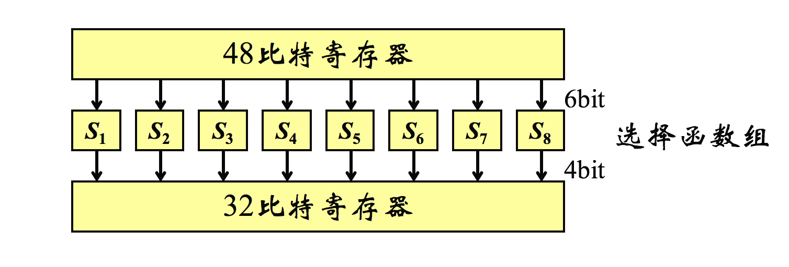

1. 第1、6比特组成的二进制数确定行
2. 中间4比特组成的二进制数确定列
3. 相应行、列位置的十进制数，用4位二进制数表示后作为输出  

举例  
S1输入：101001，则行数为11，列数为0100，即第3行和第4列。第3行、第4列的十进制数为4，用4位二进制数表示为0100，所以输出为0100

轮函数F 压缩密文位数(48->32)
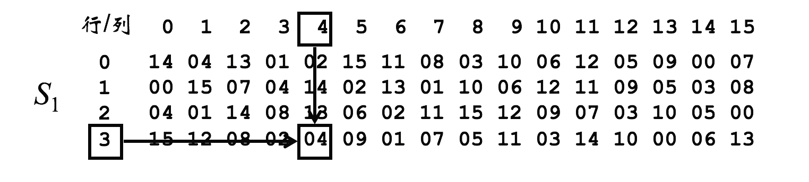


## 19. D-H密钥交换协议容易的攻击类型

* 中间人攻击  
* 重放攻击

原因：并没有提供通讯双方的身份验证服务

## 20. 公钥密码算法不会取代对称密码的原因

RSA 算法复杂，加密解密速度较慢  
对称密码技术的优点在于效率高，算法简单，系统开销小，适合加密大量数据。公钥密钥算法具有加解密速度慢的特点，密钥尺寸大

## 21. DES四种工作模式的加密解密示意图，假设加密时明文一个比特错误，对密文造成什么影响，对接收方解密会造成什么影响？

* 电码本ECB
* 密码分组链接CBC
* 密码反馈CFB
* 输出反馈OFB

---------

* 电码本ECB

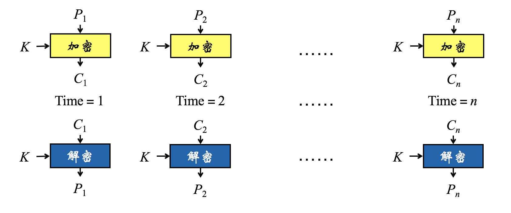

并行算法
密文块损坏->仅对应明文块损坏     
适合于传输短数据   


------

* 密码分组链接CBC

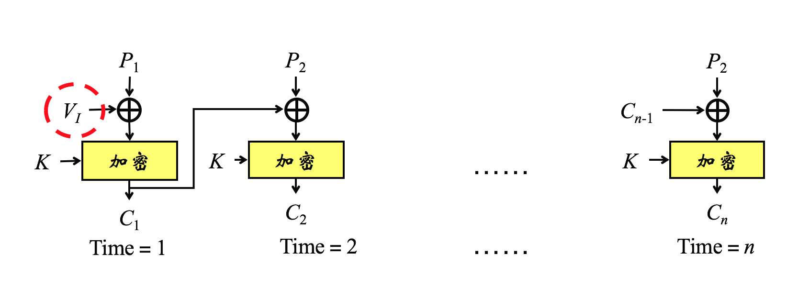

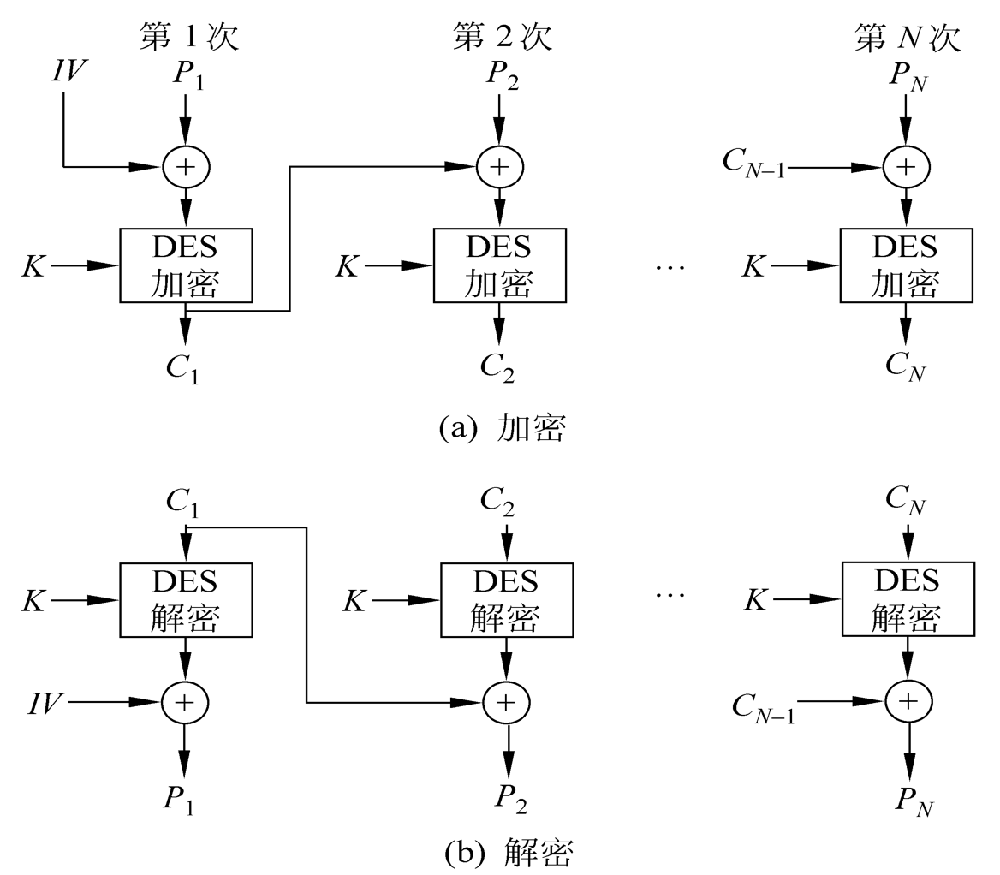

无并行算法  
加密时：任何一个明文或密文分组出错都会导致其后的密文分组出错  
解密时：密文块损坏->连续的两明文块损坏  
适合于传输长度大于64位的报文  
身份认证

------

* 密码反馈CFB


密文单元反馈到移位寄存器

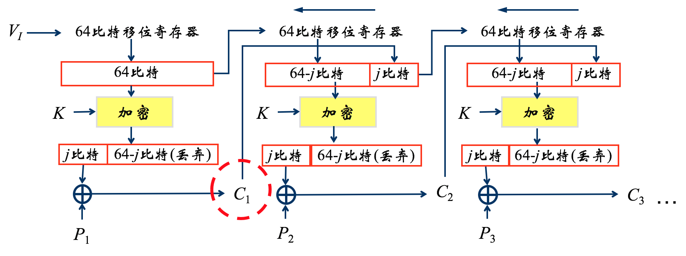

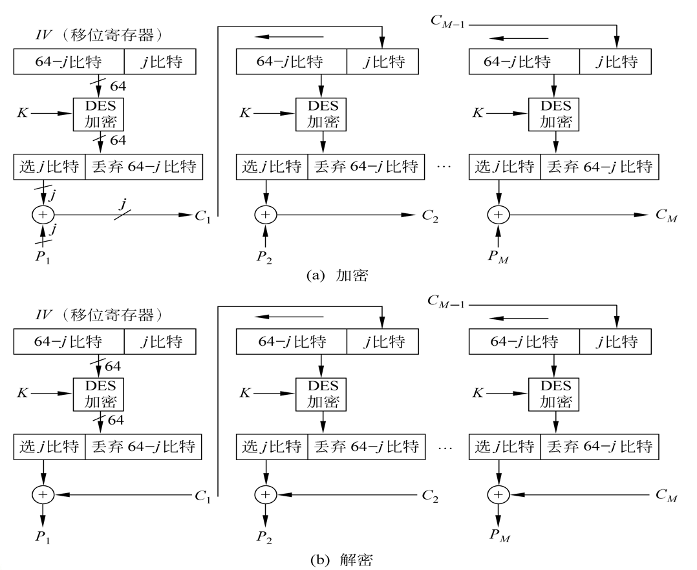

分组密码->流密码

误差传递：一个单元损坏影响多个单元？  

CFB，会导致出现连续错误

------


* 输出反馈OFB

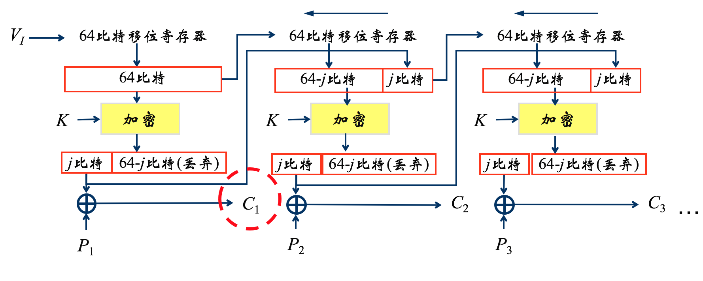

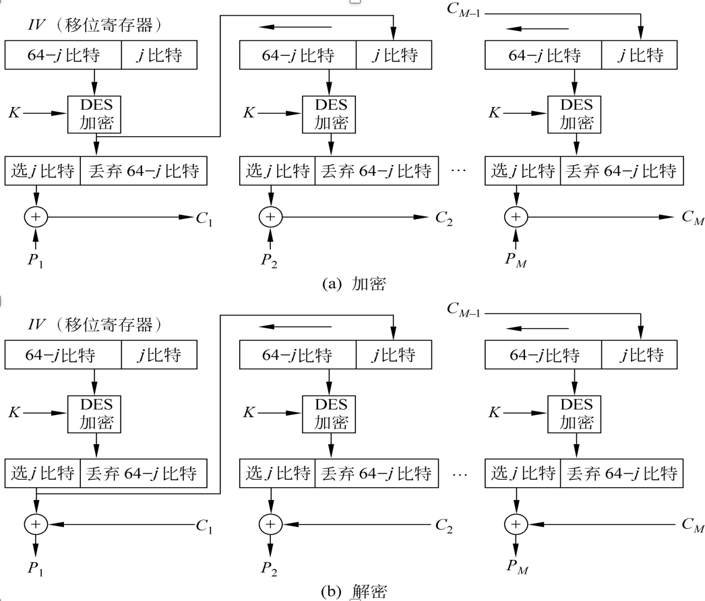

分组密码->流密码

误差传递：一个单元损坏影响多个单元？  


安全性较CFB差

OFB 影响当前

------


## 22. DES的加密过程的计算过程

1. 输入64位比特明文
2. 初始置换 IP
3. 在秘钥控制下16轮迭代
4. 交换左右 32 位
5. 初始逆置换 IP-1
6. 输出64位比特密文


## 23.	DES的密钥生成算法的计算过程
1. 置换选择1
	* 去掉8个奇偶校验位，重排56位密钥
2. 分成左右等长 28 位
3. 左右的数循环左移
4. 置换选择2
	* 去掉 ci di 的8位，重排48位
5. 输出

## 24.	仿射密码算法的计算过程
将移位和乘数替换相结合

1. 加密算法 y=ek(x)=k1*x+k2(mod 26)
2. 解密算法 x=dk(y)=k1^-1 * (y-k2)(mod 26)
3. 密钥 k=(k1,k2)

## 25. 置换密码算法的计算过程

* 栅栏密码(Rail Fence 密码)

按对角线写入明文，按行读出密文  
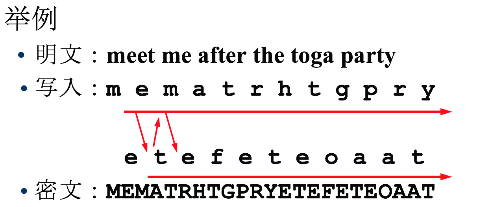

---------

* 行置换密码 (Row Transposition 密码)

将明文按行写成矩阵，按密钥逐列读出密文  
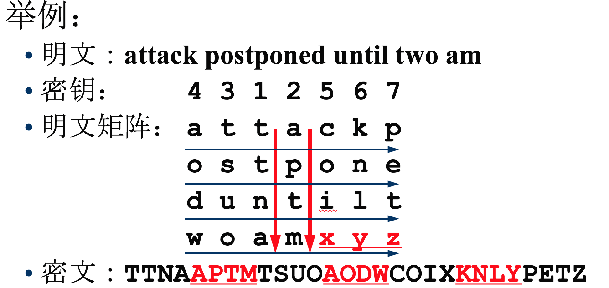

## 26.	RSA算法的计算过程
1. 选择两个大素数p和q (p≠q)
2. 计算n＝pq和n的Euler数φ(n)=(p-1)(q-1)
3. 选择随机整数e (1 < e <φ(n) )，使gcd(e,φ(n))＝1
4. 用欧氏算法计算d，使得de＝1 modφ(n)
5. 公钥：KU＝{e, n}，私钥：KR＝{d, p, q}
6. Public和Private的第二个字母
7. 加密：Ek(x)＝xe mod n
8. 解密：Dk(y)＝yd mod n

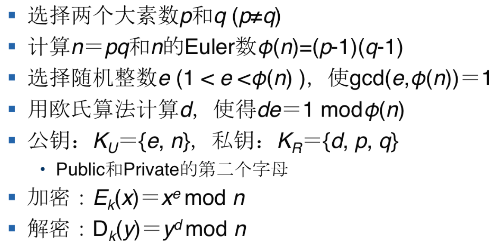