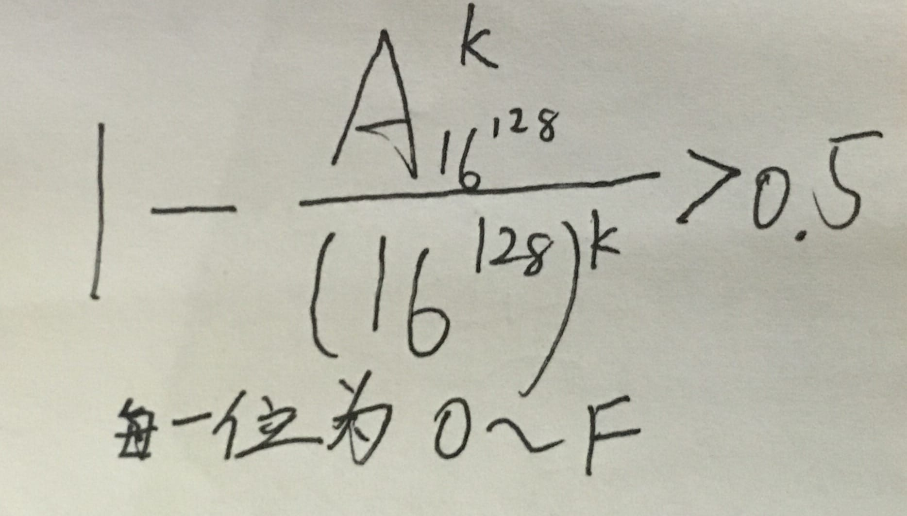

## 1.消息被篡改，这破坏了消息的什么属性
完整性

## 2. 常见身份认证方式的安全性

## 3. 计算机病毒最本质的特点

本质：程序

目的：破坏

定义：指编制或在计算机程序中插入的破坏计算机功能或者破坏数据，影响计算机使用并且能够自我复制的一组计算机指令或者程序代码


## 4.PKI支持的服务
1. 非对称密钥技术及证书管理      
2. 目录服务
3. 对称密钥的产生和分发 

----------------------------------
1. 认证
2. 完整性
3. 保密性
4. 不可否认

是一种标准的密钥管理平台，它能够为所有网络应用透明地提供加密和数据签名等密码服务所必须的密钥和证书管理

## 5. 公开密钥密码体制的公开指什么

## 6. Kerberos的设计目标
* 鉴别
* 簿记(记账)
* 审计
## 7.	PKI组成部分

1. 证书颁发/认证机构CA
2. 注册机构RA
3. 证书库
4. 密钥备份及恢复系统
5. 证书作废处理系统
6. PKI应用接口系统

## 8. APT攻击的特点

## 9. 设哈希函数H输出长度为128位，如果H的k个随机输入中至少有两个产生相同输出的概率大于0.5，则k约等于多少

## 10. 中间人攻击、字典攻击、暴力攻击、回放攻击的定义


## 11. 公钥密码的两种基本用途

加密和鉴别 （？）

## 12. 公钥密码算法不会取代对称密码的原因
RSA 算法复杂，加密解密速度较慢  
对称密码技术的优点在于效率高，算法简单，系统开销小，适合加密大量数据。公钥密钥算法具有加解密速度慢的特点，密钥尺寸大

##	 13. 常见的置换密码
* 栅栏密码(Rail Fence 密码)
* 行置换密码 (Row Transposition)
* 多步替换密码

## 14.	Kerberos中最重要的问题
协议使用时间戳(?)

时钟

## 15.	数字签名要预先使用单向Hash函数进行处理的原因
缩小签名密文的长度，加快数字签名和验证签名的运算速度  

## 16. 密码学的两个分支

* 密码编码学：主要研究对信息进行编码，实现对信息的隐蔽
* 密码分析学：研究和分析密码，实现对加密信息的破译或信息的伪造

## 17. 消息鉴别的分类

3个

## 18. 分组密码实现混淆和扩散的常用手段

替换：混淆

置换：扩散  


替换和置换
## 19.	DES算法的密钥长度
密钥长度64比特  
每8比特为一奇偶校验位  
有效密钥长度56比特

## 20. RSA算法的安全是基于什么
（？）
基于加密函数x^e mod n是一个单向函数，对攻击者来说求逆计算不可行。而解密的陷门是分解n＝pq，得知φ(n)＝(p-1)(q-1)。从而用欧氏算法解出解密私钥d
## 21. 密码体制的安全性取决于什么
常规密码体制的安全性取决于密钥的安全性（？）

## 22. 下图描述的是基于对称密码体制的中心化密钥分配方案，请补充完整图中的消息表达式，并详细描述一下每个步骤的具体内容。

* 基于NP-C问题
	* 多项式复杂程度的非确定性问题
	* 将信息加密在一个NP-C问题中，普通的方法进行破译密码等于解这个NP-C问题（很难甚至不可解），如果用解密密钥则很容易
* 陷门单向函数

（？）
## 23. 公钥密码体制的基本思想以及其相对于传统密码体制的优势

* 公钥密码体制的基本思想
	1. 是把密钥分成两个部分：公开密钥和私有密钥（简称公钥和私钥），公钥可以向外公布，私钥则是保密的（1分）；
	2. 密钥中的任何一个可以用来加密，另一个可以用来解密（1分）；
	3. 公钥和私钥必须配对使用，否则不能打开加密文件（1分）；
	4. 已知密码算法和密钥中的一个，求解另一个在计算上是不可行的（1分）。  

* 相对于传统密码体制来说
	1. 公钥密码体制中的公钥可被记录在一个公共数据库里或以某种可信的方式公开发放，而私有密钥由持有者妥善地秘密保存。这样，任何人都可以通过某种公开的途径获得一个用户的公开密钥，然后进行保密通信，而解密者只能是知道私钥的密钥持有者（1分），
	2. 该体制简化了密钥的分配与分发（1分）；
	3. 同时因为公钥密码体制密钥的非对称性以及私钥只能由持有者一个人私人持有的特性（1分），
	4. 使得公钥密码体制不仅能像传统密码体制那样用于消息加密，实现秘密通信，还可以广泛应用于数字签名、认证等领域（1分）。

## 24. 要想使得k个人中至少有两个人生日相同的概率大于0.5的话，k最小可以是多少？


## 25.	看图回答问题。请写出图中虚线框中由A发给B的消息的表达式，并说明其可以实现哪些安全服务。试说明图中采用何种算法实现数字签名，简述其实现的步骤，并分析它如何实现防抵赖。
提供的服务有：
* 消息鉴别
* 保密通信
* 数字签名

#### e.g.


## 26. PKI的全称

Public Key Infrastructure 公钥基础设施

## 27. 包过滤防火墙是在网络模型的哪一层对数据包进行检查
网络层

## 28. 对于数字签名的特点，以及包含的两个过程（？）
（？）
1. 依赖性
2. 唯一性
3. 可验性
4. 抗伪造
5. 可用性

过程（？）
鉴别和签名（私钥KR加密，公钥KU解密）

## 29.	为避免访问控制表过于庞大而采取的方法
使用组（group）和通配符（wildcard），可以有效地缩短表的长度


## 30. MAC码为什么可以在不安全的信道中传输

(?)
MAC 实现的是 消息鉴别，接收者可以通过函数验证消息是否被改变  
接收者可以确信消息M未被改变  

## 31. 防止伪造和篡改消息，属于什么的研究范畴
密码分析学（？）
## 32.	数字证书的组成
是一段包含用户身份信息、公钥信息及CA数字签名的数据  

* 用户身份信息
* 公钥信息
* CA数字签名

-------------

* 版本号1、2、3
* 证书序列号
* 签名算法标识符
	*指该证书中的签名算法
* 颁发者名称
	* CA的名字
* 有效期
	起始和终止时间
* 主体

------------


* 主体公钥信息
	* 算法
	* 参数
	* 密钥
* 颁发者惟一标识符
* 主体惟一标识符
* 扩展域
* 颁发者签名

## 33.	SHA-1算法的输出为多少比特
要求输入消息长度< 2^64比特

160


## 34.	Kerberos协议是什么协议
（？）
* 阻止非授权用户获得其无权访问的服务或数据
* 在一个开放的分布式网络环境中，用户通过工作站访问服务器上提供的服务

------------------------------------


用来在非安全网络中，对个人通信以安全的手段进行身份认证

## 35. 古典密码技术的基本加密单元

字符


## 36.	分组密码设计的两个基本原则


扩散（diffusion）和混淆（confusion）（？）




## 37.	消息鉴别码的别称

密码校验和(cryptographic checksum)

## 38. 数字签名不同的分类方法，如何分，分几类
1. 签名方式
	* 直接数字签名（Direct Digital Signature）
	* 仲裁数字签名（Arbitrated Digital Signature）
2. 安全性
	* 无条件安全的数字签名
	* 计算上安全的数字签名
3. 可签名次数
	* 一次性数字签名
	* 多次性数字签名
4. 密码体制的不同
	* 基于对称密码体制的数字签名 
	* 基于公钥密码体制的数字签名

## 39. 单机状态下验证用户身份的三种因素是什么？

1. 用户所知道的东西：如口令、密码。
2. 用户所拥有的东西：如智能卡、身份证。
3. 用户所具有的生物特征：如指纹、声音、视网膜扫描、DNA等。


## 40. 若Alice发送给Bob的消息表达式为XXXXXXXXXXXX，请画出Alice生成此消息，以及Bob检验消息的完整流程。请说明在这个流程中可以实现哪些安全服务及其原因。在这个流程中不可以实现哪些安全服务，如果要加上这些安全服务，请给出你的设计方案并说明原因。

   

## 41. 数字签名与手写签名的异同点。

* 相同点
	1. 签名者不能否认自己的签名
	2. 签名不能被伪造，且接收者能够验证签名
	3. 签名真伪有争议时，能够得到仲裁
* 不同
	1. 传统签名与被签文件在物理上不可分；数字签名则不是，需要与被签文件进行“绑定”
	2. 传统签名通过与真实签名对比进行验证；数字签名用验证算法
	3. 传统签名的复制品与原件不同；数字签名及其复制品是一样的


## 42.	替换密码的计算及其特点

## 43.	防止计算机感染病毒的措施
防火墙（？）

## 44. 入侵检测系统的功能部件

## 45. PKI管理对象
* 证书   
* 密钥       
* 证书撤消

## 46.	DES算法子密钥产生过程

* 置换选择1
	* 去掉8位奇偶校验位，重排56位密钥
* 分成左右等长的28比特C0 D0
* 计算（循环左移）
	* Ci＝LSi (Ci-1)
	* Di＝LSi (Di-1)
* 置换选择2
	* 去掉 Ci Di 中的8位，重排剩下48位
	* 输出密钥



## 47.	根据密钥类型的不同，加密算法的分类

* 对称加密算法（秘密钥匙加密）
* 非对称加密算法（公开密钥加密）

## 48.密码分析攻击分为哪几种，各有什么特点？
* 唯密文攻击
* 已知明文攻击
* 选择明文攻击
* 选择密文攻击
  
特点？

## 49.	数字签名的基本原理、作用？
（？）

数字签名与加密不同，它的主要目的是保证数据的完整性和真实性，一般包括两部分：签名算法和验证算法，通常由公钥密码算法和杂凑函数（Hash算法）结合实现。假设发送方A要向接收方B发送一消息M，并对该消息进行数字签名，其具体的原理和过程如下：①发送方A采用杂凑函数生成要发送消息M的消息摘要：Hash（M）（2分）；②发送方A采用自己的私钥Pra对消息M的消息摘要加密，实现签名：EPRa(Hash(M))，并将签名与消息M并联形成最终要发送的消息：M|| EPRa(Hash(M)),然后发送该消息（2分）；③接收方B接收到消息后，采用发送方A的公钥Pua解密签名，恢复原始消息的摘要：Hash(M)=DPUa(EPRa(Hash(M)))（2分）；④接收方B采用杂凑函数，重新计算消息M的消息摘要：H’ash(M)，并与从发送方A接收到的消息摘要进行比较,若相等，则说明消息确实是发送方A发送的，并且消息的内容没有被修改过（2分）。数字签名技术对网络安全通信及各种电子交易系统的成功有重要的作用。


------------

发送方A采用 Hash 函数生成要发送消息M的消息摘要：Hash（M）  

发送方A采用自己的私钥Pra对消息M的消息摘要加密，实现签名：EPRa(Hash(M)) 并将签名与消息M并联形成最终要发送的消息：M|| EPRa(Hash(M)),然后发送该消息

接收方B接收到消息后，采用发送方A的公钥Pua解密签名，恢复原始消息的摘要：Hash(M)=DPUa(EPRa(Hash(M)))（2分）；

接收方B采用Hash函数，重新计算消息M的消息摘要：H’ash(M)，并与从发送方A接收到的消息摘要进行比较,若相等，则说明消息确实是发送方A发送的，并且消息的内容没有被修改过（2分）
作用 数字签名是保证信息传输的保密性、数据完整的交换性、发送信息的不可否认性、交易者身份的确定性的一种有效的解决方案
## 50. 有哪几种访问控制策略、实现方法？各有什么特点、优缺点？
* 自主访问控制 DAC
* 强制访问控制 MAC
* 基于角色的访问控制 RBAC

前两种属于传统的访问控制策略，而RBAC是90年代后期出现的，有很大的优势，所以发展很快。   
每种策略并非是绝对互斥的，我们可以把几种策略综合起来应用从而获得更好、更安全的系统保护——多重的访问控制策略。  

特点、优缺点？


#### 自主访问控制
##### 实现
* 访问控制矩阵
	* 列——访问控制表（Access Control List）
	* 行——访问能力表（Access Capabilities List）

	
##### 特点
* 基于对主体及主体所在组的识别来限制对客体的访问
* 比较宽松，主体访问权限具有传递性
##### 缺点
通过继承关系，主体能获得本不应具有的访问权限

#### 强制访问控制
（？）
##### 实现
* 不同级别的实体对不同级别的客体的访问是在强制的安全策略下实现
* 访问策略：下读/上写  
##### 特点
	每个用户只能访问到那些被标明可以由他访问的信息的一种访问约束机制。通俗的来说，在强制访问控制下，用户（或其他主体）与文件（或其他客体）都被标记了固定的安全属性（如安全级、访问权限等），在每次访问发生时，系统检测安全属性以便确定一个用户是否有权访问该文件。
##### 缺点
同一用户在不同场合需要以不同的权限访问系统，按照传统做法将造成不便。当用户量增加时将使系统管理员工作量增加，也易于出错。访问控制级别太强。


####  基于角色的访问控制
##### 实现
* 通过定义角色的权限，为系统中的主体分配角色来实现访问控制
* 通过各种角色的不通搭配，来尽可能实现主体的最小授权


##### 特点
* 提供了三种授权管理的控制途径
	* 改变客体的访问权限
	* 改变角色的访问权限
	* 改变主体所担任的角色
* 系统中所有角色的关系结构层次化，易管理
* 具有较好的提供最小权利的能力，提高安全性
* 具有责任分离的能力

##### 缺点

## 51.	MD5的主要特点和工作原理是什么？

## 52. 论述数字签名与手写签名的异同点
* 相同点
	1. 签名者不能否认自己的签名
	2. 签名不能被伪造，且接收者能够验证签名
	3. 签名真伪有争议时，能够得到仲裁
* 不同
	1. 传统签名与被签文件在物理上不可分；数字签名则不是，需要与被签文件进行“绑定”
	2. 传统签名通过与真实签名对比进行验证；数字签名用验证算法
	3. 传统签名的复制品与原件不同；数字签名及其复制品是一样的

	

## 53.	防火墙的基本技术包括哪些
* 包过滤
	* 适当的网络位置，根据过滤规则对数据包实施过滤
* 代理服务
	* 防火墙主机上运行专门程序，根据安全策略处理内部网和外部网间的通信以替代相互直接通信

## 54. 安全散列函数的计算步骤

* 分块：把原始消息M分成一些固定长度的块Yi
* 填充：最后一块填充数据并使其包含M长度值
* 链接：
	* 设定初始的链接变量值VI＝CV0
	* 压缩函数f，CVi＝f (CVi-1, Yi-1)
	* 最后一个链接变量值CVL就是hash值

	

## 55. 出现时间最晚的病毒
e.g.  
下面病毒出现的时间最晚的类型是（B）  
　　A. 携带特洛伊术马的病毒 B. 以网络钓鱼为目的的病毒  
　　C. 通过网络传播的蠕虫病毒 D.OEice 文档携带的宏病毒

## 56.	AES的前身

DES

## 57.	带密钥的Hash函数和不带密钥的Hash函数各有哪些（？）


* 带密钥的Hash函数
	1. MAC
	2. whirlpool 
* 不带密钥的Hash函数
	1. MD5
	2. MD4
	3. SHA-1

## 58. 一次一密的安全性取决于什么
（？）  
一次一密的安全性是取决于密钥的随机性
## 59. OTP在实际使用中的难点？

使用与消息一样长且无重复的随机密钥来加密消息，另外，密钥只对一个消息进行加解密，之后丢弃不用。每一条新消息都需要一个与其等长的新密钥。一次一密提供安全性存在两个基本难点：  

1. 产生大规模随机密钥有实际困难。
2. 更令人担忧的是密钥的分配和保护。对每一条发送的消息，需要提供给发送方和接收方等长度的密钥。因为上面这些困难，一次一密实际很少使用，主要用于安全性要求很高的低带宽信道。

## 60.	阐述消息认证码MAC的基本概念、原理和作用
消息认证码（带密钥的Hash函数）:密码学中，通信实体双方使用的一种验证机制，保证消息数据完整性的一种工具。构造方法由M.Bellare提出，安全性依赖于Hash函数，故也称带密钥的Hash函数。消息认证码是基于密钥和消息摘要所获得的一个值，可用于数据源发认证和完整性校验



#### 概念
密码校验和  
密码学中，通信实体双方使用的一种验证机制，保证消息数据完整性的一种工具（来自百度）
#### 原理
将任意长的消息M，经共享密钥K控制下的函数C作用后，映射到一个简短的定长数据分组，并将它附加在消息M后，称为MAC，MAC＝CK(M)
接收方通过重新计算MAC进行消息鉴别
#### 作用（？）
鉴别
完整性认证

## 61.	什么是数字证书？现有的数字证书由谁颁发，遵循什么标准，有什么特点？
是一段包含用户身份信息、公钥信息及CA数字签名的数据  


数字证书是一个经证书认证中心(CA)数字签名的包含公开密钥拥有者信息以及公开密钥的文件。认证中心(CA)作为权威的、可信赖的、公正的第三方机构，专门负责为各种认证需求提供数字证书服务。认证中心颁发的数字证书均遵循X.509 V3标准。X.509标准在编排公共密钥密码格式方面已被广为接受。X.509证书已应用于许多网络安全，其中包括IPSec(IP安全)、SSL、SET、S/MIME。


特点？

## 62.	防火墙应满足的基本条件是什么？

作为网络间实施网间访问控制的一组组件的集合，防火墙应满足的基本条件如下  

* 所有从内到外和从外到内的通信量都必须经过防火墙
* 只有被认可的通信量，被访问控制策略授权后，才允许传递 
* 防火墙本身具有高可靠性


## 63. 置换密码的计算

## 64.	RSA的两种用法是什么？RSA为什么能实现数字签名？
* 数据加密
* 数字签名

#### RSA为什么能实现数字签名
1. RSA的私钥是仅有使用者知道的唯一密钥，具有唯一性；
2. 使用该密钥加密消息（既数字签名）加密者无法抵赖，具有不可抵赖性；
3. RSA加密强度保证了私钥破译计算不可行，因而难于伪造，具有保密性。


## 65. 目前对RFID系统的攻击主要是什么

对标签信息的截获和破解

* 有很多的手段可以获得芯片的结构和其中的数据
* 获取---伪造---非授权使用
* 非接触---盗取---RFID的加密机制不安全。

## 66.	RFID系统面临的攻击手段有哪些，特点是什么？

#### 主动攻击
1. 获得RFID标签的实体，通过物理手段在实验室环境中去除芯片封装、使用微探针获取敏感信号、进行目标标签的重构。   
2. 用软件利用微处理器的通用接口，扫描RFID标签和响应阅读器的探寻，寻求安全协议加密算法及其实现弱点，从而删除或篡改标签内容。   
3. 通过干扰广播、阻塞信道或其他手段，产生异常的应用环境，使合法处理器产生故障，拒绝服务器攻击等。   
#### 被动攻击
采用窃听技术，分析微处理器正常工作过程中产生的各种电磁特征，获得RFID标签和阅读器之间的通信数据。美国某大学教授和学生利用定向天线和数字示波器监控RFID标签被读取时的功率消耗，通过监控标签的能耗过程从而推导出了密码。根据功率消耗模式可以确定何时标签接收到了正确或者不正确的密码位。   
主动攻击和被动攻击都会使RFID应用系统承受巨大的安全风险   



## 67.	RFID标签出现安全隐患的原因

1. 根据实际情况选择是否具有密码功能
2. 设计思想为系统对应用是完全开放的
3. 在标签上执行加、解密运算需要耗费较多的处理器资源

## 68.	实现RFID安全机制的两类主要方法

1. 物理安全机制
2. 基于密码技术的软件安全机制

## 69.	RFID安全与隐私问题主要有哪些？

#### 数据秘密性的问题
一个RFID标签不应向未授权的读写器泄露信息。目前读写器和标签之间的无线通信在多数情况下是不受保护的（除采用ISO14443标准的高端系统）。由于缺乏支持点对点加密和密钥交换的功能，因此攻击者可以获得标签信息，或采取窃听技术分析微处理器正常工作中产生的各种电磁特征来获得通信数据。
#### 数据完整性的问题
保证接收的信息在传输过程中没有被攻击者篡改或替换。数据完整性一般是通过数字签名完成的，通常使用消息认证码进行数据完整性的检验，采用带有共享密钥的散列算法，将共享密钥和待检验的消息连接在一起进行散列运算，对数据的任何细微改动都会对消息认证码的值产生较大影响


## 70.	无线传感器网络特殊的安全问题是由什么原因造成的？

传感器网络为在复杂的环境中部署大规模的网络，进行实时数据采集与处理带来了希望。但同时WSN通常部署在无人维护、不可控制的环境中，除了具有一般无线网络所面临的信息泄露、信息篡改、重放攻击、拒绝服务等多种威胁外，WSN还面临传感节点容易被攻击者物理操纵，并获取存储在传感节点中的所有信息，从而控制部分网络的威胁。用户不可能接受并部署一个没有解决好安全和隐私问题的传感网络，因此在进行WSN协议和软件设计时，必须充分考虑WSN可能面临的安全问题，并把安全机制集成到系统设计中去

